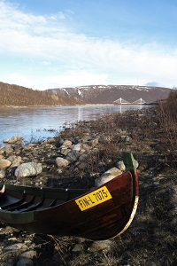
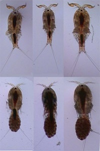

 

  
 

 

  <h2>Genomic signatures of local selection in Atlantic salmon</h2>
Understanding how populations adapt to their local environment both improves our understanding of how biodiversity evolves, and guides our management of threatened or exploired taxa. With [Craig Primmer](https://www.molecularecologist.com/2017/12/how-molecular-ecologists-work-craig-primmer-on-solving-problems-on-the-bike-and-in-the-sauna/) at the University of Turku, I have been using dense genomic datasets to identify loci potentially underlying local adaptation in Atlantic salmon (*Salmo salar*). My main study system is the large [Teno (Tana) River](https://www.luke.fi/en/natural-resources/fish-and-the-fishing-industry/fish-resources/salmon-2/river-teno-salmon/) salmon stock of northern Finland and Norway, which comprises multiple, genetically distinct, sub-populations. Comparing juvenile fish from different locations, I identified signals consistent with [differential local selection](https://onlinelibrary.wiley.com/doi/abs/10.1111/mec.14705) around genes associated with variation in sexual maturation, energy homeostasis and immune defence. These included the large-effect [age-at-maturity gene](https://www.biorxiv.org/content/early/2015/08/20/024695) *vgll3* , the well-known obesity gene *mc4r*, and major histocompatibility complex II. Most strikingly, I confirmed a region on Chromosome 9 that is extremely differentiated among Teno sub-populations and is also a candidate for local selection over the [global range](https://www.biorxiv.org/content/early/2018/06/15/347724) of Atlantic salmon. This region overlaps with a haplotype strongly associated with [spawning ecotype](https://www.nature.com/articles/s41598-017-01890-2) in sockeye salmon (*Oncorhynchus nerka*), suggesting that the same gene may be the selective target in both cases. The phenotypic effect of this region in Atlantic salmon is unknown, although allelic variation is related to upstream catchment area and covaries with timing of the return spawning migration. My ongoing follow-up work examining Atlantic salmon populations in north-western Russia, and comparing results from similar studies, indicates that many of the same loci could be adaptively important in Atlantic salmon at regional and continental scales, as well as in other salmonid species.
This research is part of the [Integrative Science for Adaptive Co-Management in the Arctic](https://www.aka.fi/globalassets/32akatemiaohjelmat/arktinen/hanke-esitteet-en/arktiko_primmer.pdf) project.

 

      

 

  
 

 

  <h2>Factors influencing hybridization between wild Atlantic salmon and aquaculture escapees</h2>

Wild Atlantic salmon are threatened by introgressive hybridization with domestic salmon that have escaped from fish farms. While some wild populations have shown genetic changes as a result of this interbreeding, other populations have retained their genetic integrity despite receiving similar numbers of escapees. It is unknown what makes an Atlantic salmon population vulnerable to such ‘genetic invasion. I am addressing this question by studying wild-escapee hybridization in the Teno River using a 45 year scale archive. I have identified a set of [SNP markers](https://onlinelibrary.wiley.com/doi/abs/10.1111/eva.12407) that can collectively discriminate different classes of aquaculture-wild hybrids. Currently, I am using these to investigate hybridization dynamics over space and time with the aim of identifying environmental and demograpic factors that influence these dynamics.

 

 

  
 

 

  <h2>Regulatory architecture of gene expression variation in the threespine stickleback</h2>
  
Adaption to novel environments ofteninvolves changes in regions of the genome that regulate gene expression, rather than in the coding regions of genes themselves. The threespine stickleback (*Gasterosteus aculeatus*) is an important model for local adaptation, yet the regulatory architecture of gene expression variation is not well characterized in this species. Working with [Erica Leder](http://users.utu.fi/eriled/index.html) and Craig Primmer at the University of Turku I combined gene expression and RAD-tag datasets for sib/half sib stickleback families and used a QTL mapping approach to identify regions of the genome underlying expression variation in over 10,000 genes. [Results](http://www.g3journal.org/content/7/1/165) suggested the presence of several QTL 'hotspots' that influenced the expression of multiple, distant genes. However, these 'hotspots' did not overlap with regions of the genome known to be involved in stickleback adaptive divergence.

 

 

  
 

 

  <h2>Conservation genetics of cutthroat trout</h2>

The interior cutthroat trout (*O. clarki* subsp.) of western North America have declined to a fraction of their native range as a result of habitat loss and hybridization with introduced rainbow trout (*O. mykiss*). In collaboration with [David Cowley](http://aces.nmsu.edu/academics/fws/david-cowley.html) at New Mexico State University, [Jessica Metcalf](http://www.jessicalmetcalf.com/) and [Andrew Martin](https://www.colorado.edu/ebio/andrew-martin) at the University of Colorado, [John Carlos Garza](https://www.nytimes.com/2016/01/19/science/new-tactics-to-save-californias-decimated-salmon-population.html
) at the Southwest Fisheries Science Center and [Mary Peacock](https://www.unr.edu/biology/people/mary-peacock) at the University of Nevada, I used population genetic approaches to guide cutthroat trout management. My work showed that population [fragmentation](https://www.tandfonline.com/doi/abs/10.1577/T06-038.1) has had important genetic consequences; that a signature of evolutionary independence [can be retained](https://link.springer.com/article/10.1007/s10592-008-9652-8) between drainages despite large scale transplants of fish between them; but that such historic transplants could also result in populations being [mis-identified](https://onlinelibrary.wiley.com/doi/abs/10.1111/j.1365-294X.2007.03472.x) and containing [unexpected genetic contributions](https://link.springer.com/article/10.1007%2Fs10592-015-0712-6) from other cutthroat subspecies. I also found that levels of non-native introgression estimated using existing non-diagnostic markers such as microsatellites [varied](https://link.springer.com/article/10.1007/s10592-006-9280-0) with the statistical method and pure reference sample used. This conflicted with recommendations placing cutthroat trout populations into different management categories based on threshold introgression levels. To solve this problem, I subsequently developed a large set of [SNP markers](https://onlinelibrary.wiley.com/doi/abs/10.1111/j.1755-0998.2012.03149.x) diagnostic between rainbow trout and all cutthroat trout subspecies.

 

 

  
 

 

  <h2>Consequences of inter-population hybridization in *Tigriopus californicus*</h2>
  
Although introgressive hybridization with introduced taxa is a threat to many species of conservation concern, the consequences of this hybridization are difficult to predict. Examining the outcomes of inter-population hybridization in the laboratory can both inform the management of such threatened taxa, and shed light on genomic interactions that contribute to reproductive barriers between species. I undertook this work with [Suzanne Edmands](https://dornsife.usc.edu/labs/edmands/) at the University of Southern California, using the intertidal copepod *Tigriopus californicus* - an important model for outbreeding depression. [Genotypic deviations](https://bmcgenet.biomedcentral.com/articles/10.1186/1471-2156-12-54) from Hardy-Weinberg equilibrium in controlled crosses between populations suggested that hybrid fitness was influenced both by nuclear-nuclear epistatic interactions and by the presence of deleterious recessive alleles in the parental populations. [Genomic outcomes](https://onlinelibrary.wiley.com/doi/abs/10.1111/j.1558-5646.2012.01814.x) in long term, freely mating, hybrid swarms partly reflected random factors: variation among replicates in the initial contribution of pure parents, and genetic drift. Thus, the outcome of a hybridization event in nature may not be predictable. However, deterministic factors were also important: where pure parents exhibited differential fitness in the lab, genetic material from the fitter population rapidly dominated a swarm. Thus, an invasive species that is more fit in the local environment may rapidly cause ‘genetic swamping’ of the native population. Different parts of the genome exhibited differential patterns of introgression, which could be strikingly similar across replicate swarms and reflected the genotypic distortion previously observed in controlled crosses. This suggested that deleterious genotypic combinations were removed by selection over time - correspondingly, hybrid swarms showed [no long-term decrease](https://onlinelibrary.wiley.com/doi/abs/10.1111/jeb.12060) in fitness compared to their pure parents. Thus, even with reduced fitness in initial generations, populations may be able to [recover](https://onlinelibrary.wiley.com/doi/abs/10.1111/jeb.12913) from the deleterious effects of non-native introgression.

 

 

  
 

 

  <h2>Other research</h2>
**Morphological variation in the zebrafish, *Danio rerio***: The south Asian cyprinid genus <i>Danio</i> includes many small fishes that differ strikingly in their color pattern.This pigmentation variation may play a role in speciation within the genus. Little is known, however, about pattern variation within <i>D. rerio</i> in the wild. As part of my PhD, under the supervision of [Roger Butlin](https://www.sheffield.ac.uk/aps/staff-and-students/acadstaff/butlin) at the University of Leeds, I investigated the variation and heritability of body and
fin among and within populations of zebrafish that I collected from Bangladesh and
Nepal. 

**The social organization of fish shoals:** in collaboration with [Jens
Krause](http://www.igb-berlin.de/en/profile/jens-krause) and [Dominic Wright](https://liu.se/en/employee/domwr72), I also used the zebrafish to investigate factors mediating fish [schooling preferences](https://www.sciencedirect.com/science/article/pii/S0003347201918585).

**Population divergence in the meadow grasshopper**: with [Tom
Tregenza](http://www.selfishgene.org/Tom/index.htm) and Roger Butlin, I worked on a project
using the meadow grasshopper, <i>Chorthippus parallelus</i>, to test hypotheses
about what drives [population divergence](https://onlinelibrary.wiley.com/doi/abs/10.1111/j.0014-3820.2000.tb00060.x) and [reproductive isolation](https://onlinelibrary.wiley.com/doi/abs/10.1111/j.0014-3820.2000.tb00713.x.).
 

      
 