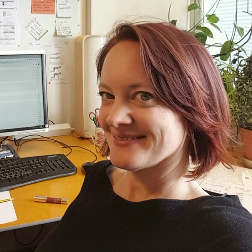

 

  
 

 

I am an evolutionary biologist, whose research examines genomic, morphological and behavioral divergence amongst populations, and the consequences of hybridization between those populations. My work provides direct insights into how the diversity of life arises. It also has practical applications to managing populations of conservation or economic concern. I am interested in a wide variety of taxa - currently, I focus on salmonid fishes.

Right now, I am part of the [Evolution, Conservation and Genomics](https://www.helsinki.fi/en/researchgroups/evolution-conservation-and-genomics) research group at the Universities of Helsinki and Turku in Finland.

Contact me: victorialpritchard [at] gmail.com.

My CV is available [here](VLPritchard_CV_2018_Europe.pdf).

My Google Scholar profile is [here](https://scholar.google.fi/citations?user=EkuZ22sAAAAJ&hl=en).

Download my publications from [here](VLP_Publications.html).

I (mostly re-) tweet from [here](https://twitter.com/genvlp?lang=en).

 

